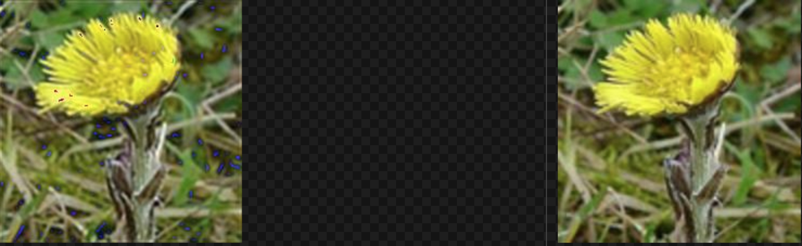

The *.prototxt are offered by the author of the SRCNN

The result after 110000 steps:

 - The `srcnn.py` gen the reconstruction image after 40000 steps.
 - add the augmentation func (to do)
   - 
   - Flipping, Rotating and Transposing:
      - `tf.image.random_flip_up_down`
      - `tf.image.random_flip_left_right`
   - Image Adjustments
      - `tf.image.random_brightness`
      - `tf.image.random_contrast`
      - `tf.image.random_hue`

srcnn.py is the srcnn in tensorflow writen by Burness.duan